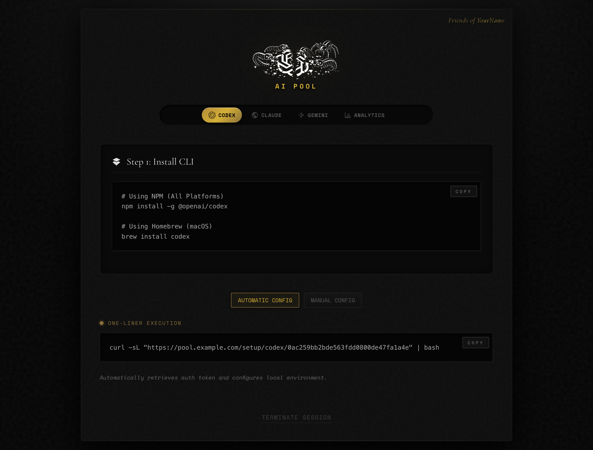

# codex-pool

A reverse proxy that load-balances AI CLI traffic across multiple accounts. Supports **Codex CLI** (OpenAI), **Claude Code** (Anthropic), and **Gemini CLI** (Google).

## Features

- **Multi-provider support** - Pool accounts from Codex, Claude, and Gemini
- **Intelligent load balancing** - Routes requests to accounts with most available capacity
- **Automatic token refresh** - Keeps OAuth tokens fresh before they expire
- **Conversation pinning** - Maintains context by routing conversations to the same account
- **Usage analytics** - Track token consumption across accounts and users
- **Two deployment modes**:
  - **Local mode** - Direct access for personal use
  - **Friends mode** - Share your pool with others using friend codes

## Screenshots

### Local Mode
Direct setup instructions without authentication:


### Friends Mode
Requires a friend code to access the pool:


After authentication, users get setup instructions for all supported CLIs:



Pool analytics showing account status and usage:


## Quick Start

### 1. Add account credentials

Create a `pool/` directory and add your credential files:

```bash
mkdir -p pool

# Codex accounts (any .json file without prefix)
cp ~/.codex/auth.json pool/personal.json

# Gemini accounts (gemini_ prefix)
cp ~/.gemini/oauth_creds.json pool/gemini_main.json

# Claude accounts (claude_ prefix)
echo '{"api_key": "sk-ant-..."}' > pool/claude_work.json
```

### 2. Run the proxy

```bash
go build -o codex-pool && ./codex-pool
```

The proxy starts on `http://127.0.0.1:8989` by default.

### 3. Configure your CLI

#### Codex CLI

Add to `~/.codex/config.toml`:

```toml
model_provider = "codex-pool"
chatgpt_base_url = "http://127.0.0.1:8989/backend-api"

[model_providers.codex-pool]
name = "OpenAI via codex-pool proxy"
base_url = "http://127.0.0.1:8989/v1"
wire_api = "responses"
requires_openai_auth = true
```

#### Claude Code

```bash
export ANTHROPIC_BASE_URL="http://127.0.0.1:8989"
export ANTHROPIC_API_KEY="pool-user-key"
```

#### Gemini CLI

```bash
export CODE_ASSIST_ENDPOINT="http://127.0.0.1:8989"
gemini
```

Or add to `~/.gemini/settings.json`:

```json
{
  "codeAssistEndpoint": "http://127.0.0.1:8989"
}
```

## Configuration

Create a `config.toml` file for advanced options:

```toml
# Server settings
listen_addr = "127.0.0.1:8989"
pool_dir = "pool"
db_path = "./data/proxy.db"
debug = false

# Friends mode (optional - omit for local mode)
friend_code = "your-secret-code"
friend_name = "YourName"
friend_tagline = "For the few who know, the pool awaits."

# Pool users / multi-user mode (optional)
[pool_users]
admin_password = "admin-password"
jwt_secret = "32-character-secret-for-jwt-tokens"
storage_path = "./data/pool_users.json"
```

### Environment Variables

All config options can be set via environment variables:

| Variable | Default | Description |
|----------|---------|-------------|
| `PROXY_LISTEN_ADDR` | `127.0.0.1:8989` | Listen address |
| `POOL_DIR` | `./pool` | Directory containing credential files |
| `PROXY_DB_PATH` | `./data/proxy.db` | BoltDB path for usage tracking |
| `PROXY_MAX_ATTEMPTS` | `3` | Retry attempts across accounts |
| `PROXY_DEBUG` | `0` | Enable debug logging |
| `FRIEND_CODE` | (none) | Enable friends mode with this code |
| `FRIEND_NAME` | (none) | Name shown on friends landing page |

## Credential File Formats

### Codex (any `.json` without prefix)

```json
{
  "tokens": {
    "id_token": "eyJ...",
    "access_token": "...",
    "refresh_token": "...",
    "account_id": "acct_..."
  }
}
```

### Gemini (`gemini_*.json`)

```json
{
  "access_token": "ya29...",
  "refresh_token": "1//...",
  "expiry_date": 1234567890000
}
```

### Claude (`claude_*.json`)

API key format:
```json
{
  "api_key": "sk-ant-api-...",
  "plan_type": "max"
}
```

OAuth format (from Claude Code):
```json
{
  "claudeAiOauth": {
    "accessToken": "...",
    "refreshToken": "...",
    "expiresAt": 1234567890000,
    "subscriptionType": "pro"
  }
}
```

## API Endpoints

| Endpoint | Description |
|----------|-------------|
| `GET /` | Landing page (local or friends mode) |
| `GET /healthz` | Health check with account counts |
| `GET /status` | Detailed pool status |
| `GET /admin/accounts` | JSON view of all accounts |
| `POST /admin/reload` | Hot-reload accounts from disk |
| `GET /admin/pool-users` | Manage pool users (password protected) |

## How It Works

1. **Account Loading** - On startup, the proxy loads all credential files from the pool directory
2. **Request Routing** - Each request is routed to the account with the most available quota
3. **Conversation Pinning** - Requests with a `conversation_id` are pinned to the same account
4. **Token Refresh** - OAuth tokens are automatically refreshed before expiry
5. **Retry Logic** - Failed requests are retried on different accounts
6. **Usage Tracking** - Token consumption is tracked per account and per user

## Building

```bash
# Development
go run .

# Production build
go build -o codex-pool

# Cross-compile for Linux
GOOS=linux GOARCH=amd64 go build -o codex-pool-linux
```

## License

MIT
