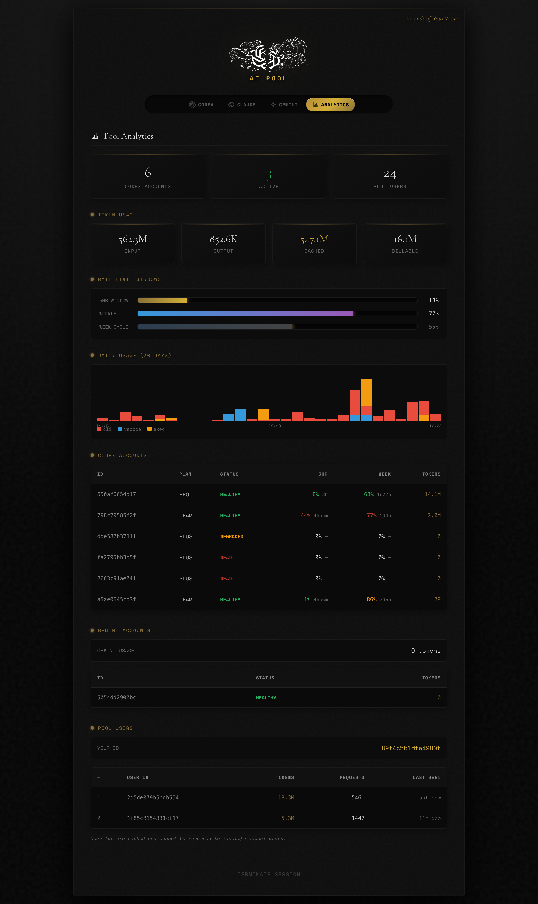
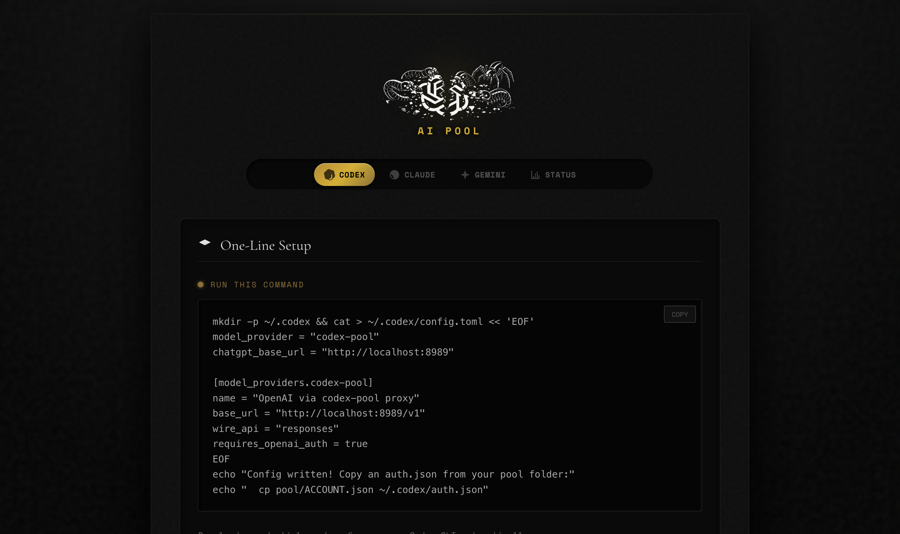
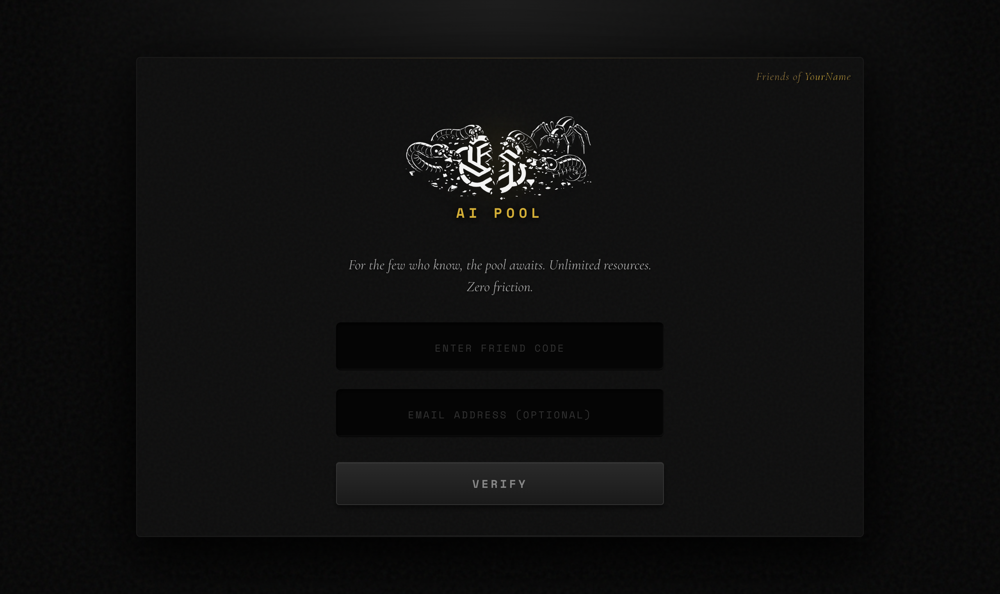

<p align="center">
  
</p>

<h1 align="center">codex-pool</h1>

<p align="center">
  <strong>Pool your accounts. Share with friends. Never swap credentials again.</strong>
</p>

---

A reverse proxy that distributes your Agent (Codex/Claude/Gemini) sessions across multiple accounts. Got three Codex accounts? Five Claude logins? The proxy spreads your usage across all of them automatically - no manual switching, no juggling auth files.

Works with **Codex CLI**, **Claude Code**, and **Gemini CLI**.

<p align="center">
  
</p>

---

## Why

You hit rate limits. You have multiple accounts. Swapping credentials is annoying.

Or maybe you want to pool accounts with friends - everyone throws their accounts into the pot, everyone benefits from the combined capacity.

**codex-pool** handles it:
- Distributes sessions across all your accounts for each service
- Routes to whichever account has capacity
- Pins conversations to the same account (ensures standard cached token performance)
- Auto-refreshes tokens before they expire
- Proxies WebSocket upgrades (including Codex Responses WS and realtime `/ws` flows)
- Tracks usage so you can see who's burning through quota

---

## Screenshots

### Setup Dashboard

<p align="center">
  
</p>

### Friends Mode
Share your pool with others using a friend code.

<p align="center">
  
</p>

---

## Quick Start

### 1. Add your accounts

```bash
mkdir -p pool/codex pool/claude pool/gemini

# Codex accounts
cp ~/.codex/auth.json pool/codex/work.json
cp ~/backup/.codex/auth.json pool/codex/personal.json

# Claude accounts
cp ~/.claude/credentials.json pool/claude/main.json

# Gemini accounts
cp ~/.gemini/oauth_creds.json pool/gemini/main.json
```

Structure:
```
pool/
├── codex/
│   ├── work.json
│   └── personal.json
├── claude/
│   └── main.json
└── gemini/
    └── main.json
```

### 2. Run it

```bash
go build && ./codex-pool
```

### 3. Point your CLI

**Codex** - `~/.codex/config.toml`:
```toml
model_provider = "codex-pool"
chatgpt_base_url = "http://127.0.0.1:8989/backend-api"

[model_providers.codex-pool]
name = "OpenAI via codex-pool proxy"
base_url = "http://127.0.0.1:8989/v1"
wire_api = "responses"
requires_openai_auth = true
```

**Claude Code**:
```bash
export ANTHROPIC_BASE_URL="http://127.0.0.1:8989"
export ANTHROPIC_API_KEY="pool"
```

**Gemini CLI**:
```bash
export CODE_ASSIST_ENDPOINT="http://127.0.0.1:8989"
```

---

## Friends Mode

Pool accounts with friends. Set a code, share the URL:

```toml
# config.toml
friend_code = "secret-code"
friend_name = "YourName"
```

They log in, get setup instructions, start using the pool. You see everyone's usage in analytics.

---

## Configuration

```toml
listen_addr = "127.0.0.1:8989"
pool_dir = "pool"

# Friends mode
friend_code = "your-secret"
friend_name = "YourName"

# Multi-user tracking
[pool_users]
admin_password = "admin"
jwt_secret = "32-char-secret-for-jwt-tokens!!"
```

Environment variable `PROXY_MAX_INMEM_BODY_BYTES` controls how large a request body can be before the proxy streams it directly (no retries). Default is 16777216 (16 MiB).

---

## Credential Formats

**Codex** - `pool/codex/*.json`
```json
{"tokens": {"access_token": "...", "refresh_token": "...", "account_id": "acct_..."}}
```

**Claude** - `pool/claude/*.json`
```json
{"claudeAiOauth": {"accessToken": "...", "refreshToken": "...", "expiresAt": 1234567890000}}
```

**Gemini** - `pool/gemini/*.json`
```json
{"access_token": "ya29...", "refresh_token": "1//...", "expiry_date": 1234567890000}
```

---

## Disclaimer

This pools credentials you own. Using multiple accounts or sharing access may violate terms of service. If something goes sideways, that's on you.

---

## License

MIT
